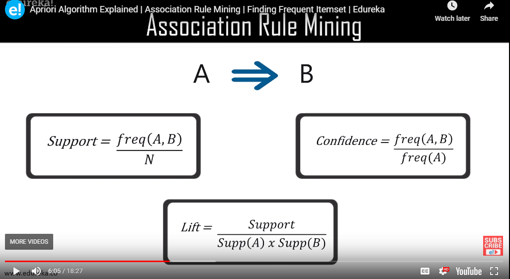
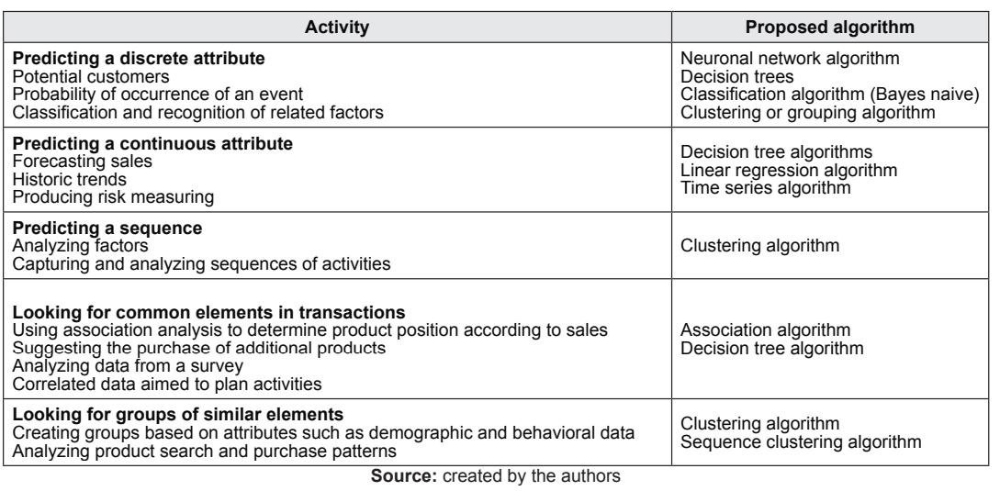

# Choosing Algorithms

## Knowledge-based model to support decision-making when choosing between two association data mining techniques (2017)

In _Revista Lasallista de Investigación. jul-dic2017, Vol. 14 Issue 2, p41-50. 10p._; [Giraldo Mejia et a.](KnowledgeBasedModel_Supporting_DecisionMaking.pdf) discuss logistic regression and association rules (Apriori Algorithm) as two strategies to perform data mining.

Knowledge Discovery in Databases (KDD) is composed of three stages:

- the understanding of the business and its data
- the carrying out of the pre-process tasks
- the actual data mining and reporting.

> Data mining is defined as an automated process of knowledge discovery from large volumes of data.  The process involves three disciplines: the databases
that provide complex data structures, Statistics, and Artificial Intelligence (AI).

### What is Apriori Algorithm

Apriori algorith uses frequent item sets to generate assocation rules.  It is based on the concept that a subset of a frequent itemset must also be a frequent itemset.  Frequent itemset is an items set whose support value is greather than a threshold.  This strategy allows garbage pairs to be discovered early and filtered before calculating

Edureka.co [explains](https://youtu.be/guVvtZ7ZClw) this algorithm as market basket analysis, and high lights its the discovery of `if <A> then <B>` assocaitions; such as person buying bread will likely buy butter.  As the cardinality increases there needs to be measure assocation as `Support`, `Confidence` and `Lift`.

### What is logistic regression

A strategy to approximate the value of a parameter set equally a value.  For instance, housing prices are based on the square footage, age of the house, and similar feature values.

### Which algorithm should we use

> Even though an experienced analyst has the knowledge and experience on data mining techniques, selecting the best algorithm for a specific analytical task could be a challenge.

