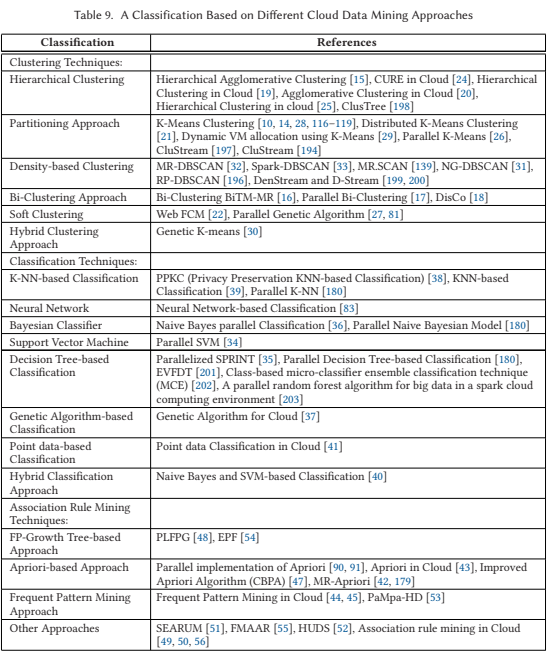

# Data Mining in the Cloud

## A Comprehensive Survey on Cloud Data Mining (CDM) Frameworks and Algorithms (2019)

In _CM Computing Surveys. Sep2019, Vol. 52 Issue 5, p1-62. 62p._; [Barua, H; Mondal, K](Survey_CloudMining_Frameworks.pdf) provide a taxomy of different cloud data mining frameworks and algorithms-- that are basically recognized in the form of _Descriptive analysis, Associative analysis, Discriminant paradigm, and Predictive analysis_.

> Underlying storage systems and memory implementations are the major attributes that distinguish these frameworks from each other. In this regard, the major frameworks identified in this review are: Map Reduce [1, 2], Distributed Graph Lab [11, 12], Sector Sphere [6], and Parameter Sweeping [10].

### How do the Map-Reduce Products Differ

### Sector/Sphere Tutorial (2010)

> Sector is a high performance, scalable, and secure distributed file system. Sphere is a high performance parallel data processing engine that can process Sector data files on the storage nodes with very simple programming interfaces.

The [SourceForge project](http://sector.sourceforge.net/) provides a tutorial by Gu, Y that is [locally cached](Sector-cloudcom-tutorial.pdf).  In a nutshell its another Hadoop.

### Paramater Sweeping

In a nutshell the authors are proposing linking a PaaS service to a worker queue.  Each message in the queue represent a task that specifies different storage objects that are too be tested under different parameters... thus through horizontal scaling brute force strategies can be efficiently calculated.

### Distributed Graph Lab

A collection of technologies for performing matrix multiplication across graph structures.  This is critical for scenarios such as recommendation systems as the matricies represent the relative weights of associated objects.

### What algorithms are commonly used

Starting at page 25 there is a detailed analysis of each of these algorithms and how they differ.  Each of these leafs (e.g., associaation rule mining) has an entire subsection

### Any final thoughts

