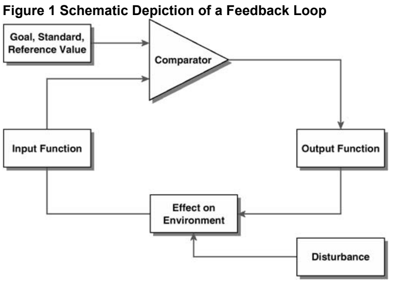

# Experiment Design Strategies

## Feedback Loop (2007)

In _Sage Reference: Encyclopedia of Social Psychology_; [Carver, S](Feedback_Loops.pdf) discusses the need to evaluate causation versus coorelation in experiments, as this will greatly influence our discoveries.  He offers guidance, such as making one variable static while rotating another to measure the _feedback loop_ and determine if its really new information or _we just seeing what we wanted to see_.

If the factor introduces a causality then it should be explainable in a rational manner.  For instance, a person studies for two additional hours they might have better grades, or they might have just stared at the screen the whole time.  We need to understand the context and then the _relevance_ can be assessed.

