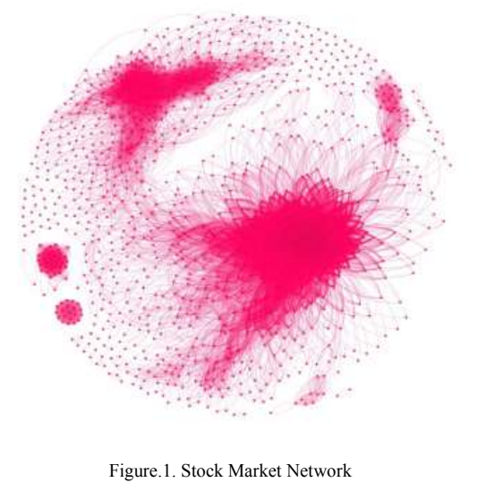

# Market Data Mining

## A Data mining algorithm to analyse stock market data using lagged correlation (2008)

At _2008 International Conference on Information and Automation for Sustainability (ICIAFS)_; [Fonseka & Liyanage](Mining_using_Lagged_Correlation.pdf) provide a market direction prediction strategy by looking at stocks that have a high correlation over a lag of k-days.  They use the correlation information to quantity the risk association with the short term movement in a related product to improve their predictions.

Their research is not very useful as it does not address different market conditions.  They tested during the end of 2008 and discovered that guessing down was highly accurate, though everything at the end of 2008 went down.  In section 2B denotes that the period 2005-2008, however little confirmation of 2005-7 is provided.

## Data Analytics and Business Intelligence Framework for Stock Market Trading (2019)

The authors [AlArmouty & Fraihat](Analytics_and_BI_for_StockMarket_Trading.pdf) describe a custom built system for investment trading, that leverages OHLCV public data and detail the business intelligence and data management strategy used.  They focused on transforming the data for analysis through Tableau and did not provide any new information to the general body of knowledge.

## A Novel Framework for Stock Trading Analysis Using Casual Relationship Mining (2017)

In _2017 Third International Conference on Advances in Electrical, Electronics, Information, Communication and Bio-Informatics (AEEICB) Advances in Electrical, Electronics, Information, Communication and Bio-Informatics (AEEICB), 2017 Third International Conference on. :136-141 Feb, 2017_; [Bhoopathi & Rama](Casual_Relationship_Mining.pdf) use item set association to mine for patterns across different financial instruments.

They use an Apriori-like algorithm to creat the association rules and determine direct, indirect, and exclusive relatioships across the stock database.  Next they attempted to derive associations from stocks such as Intuit (INTU), Global Infrastructure (IGT) and International Flavors and Fragerance (IFF) over short periods (~25/30 days).  A likely explaination might be that the broader market sentimate had more impact than these specific items. This goes back to the validation of `practicality and validity of results proposed`.

However, there could be some validity of the experiment over a longer time period (study is only 2009)-- and looking across multiple windows.  For instance, USP and Fedex are in the same sector and influenced by similar political and economic events.

## Mining for Core Patterns in Stock Market Data (2009)

In _2009 IEEE International Conference on Data Mining Workshops_; [Wu; Elariss, Xu](Mining_CorePatterns_in_MarketData.pdf) begin with grouping of financial instruments into their associated sectors and then looking at the actual vs expected density of their histograms.  They perform a sliding window validation to detect the significant sectors, as those with more neighbors than the expected count.

### What is Density-based spatial clustering of application with noise (DBSCAN)

A common data mining algorithm that takes a minimum distance and minimum number of points, then estimates the unsupervised clusters that meet those densities.

Ester, M., Kriegel, H. P., Sander, J., & Xu, X. (1996, August). A density-based algorithm for discovering clusters in large spatial databases with noise. In Kdd (Vol. 96, No. 34, pp. 226–231).

### How does High Desnity Vectors compare

The authors suggest that their approach to determining cluster density is more stable than DbScan, when the expected and actual hyperplane can be inferred.  Though its unclear that this is better than random sampling and might require additional time to understand what the graphs are conveying.

## Does the use of Technical & Fundamental Analysis improve Stock Choice? (2012)

At _2012 International Conference on Statistics in Science, Business and Engineering (ICSSBE) Statistics in Science, Business, and Engineering (ICSSBE), 2012 International Conference on. :1-6 Sep, 2012_; [Hargreaves & Yi](DataMining_Technical_vs_Fundamental_Analysis.pdf) describe an investment strategy that begins with 2000 Australian stocks and narrows it down to a porfolio of 6 stocks.  They accomplish this by first choosing the best sectors, then filtering by fundamental analysis to only the most efficient companies that are growing.

This prefiltering provides an effective strategy to apply some domain knowledge toward data set reduction.  They used static rules build a trading strategy that performed well over a short period of time.  There was also discussions around the use of `decision trees` as a mechanism to further filter data.

## Network approach for Stock market data mining and portfolio analysis (2017)

At _2017 International Conference on Networks & Advances in Computational Technologies (NetACT) |20-22 July 2017| Trivandrum_; [George & Changat](Network_approach_StockMarket_datamining_and_portfolio_analysis.pdf) look at inter-related risk caused the associations between different businesses.  For instance, Bear Stearns collapse during the housing crisis caused a ripple as they failed to repay debt obligations.

The authors created a network based on daily OHLC data with each stock (node) containing edges (correlation) to one another over time (where R >0.70).  The network was then explored to determine which nodes were the most critical (and it appears to be mostly banks).

It would be interesting to repeat this experiment over different time periods, as 2016 was the beginning of rate normalization and performed well in general.  There are other aspects that appear to be missing, such as the majority of economic returns were from the FAMNG tech titans-- yet those do not appear within the map.

