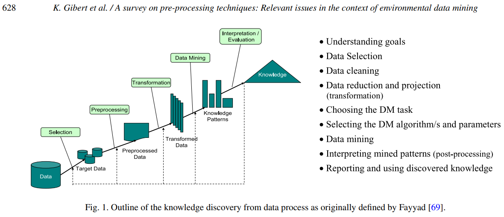
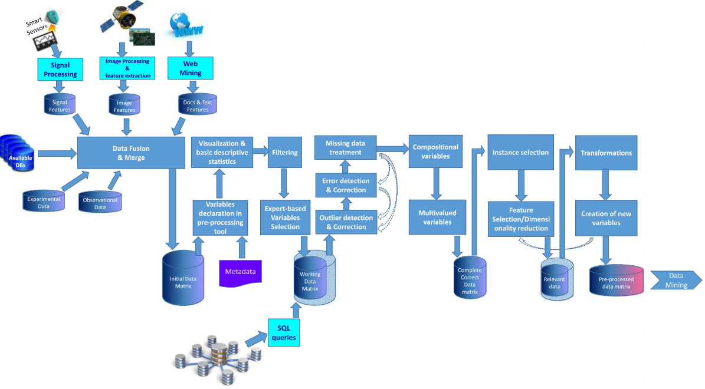

# Literature Review

## A Study of Algorithm Selection in Data Mining using Meta-Learning (2017)

In _Journal of Engineering Science & Technology Review. 2017, Vol. 10 Issue 2, p51-64. 14p._; [Tripathy, M; Panda, A](AlgorithmSelection.pdf) describes the challenges of the `No Free Lunch Theorm` that states _an algorithm does not exist which works equally well in all scenarios_.  They address the issue with a meta-learning strategy that applies several categories of learning algorithms and then measures the performance.  

The researchers also used clusters and classification algorithms to examine the shapes of aprx 77 open source data sets.  This approach allows them to partition large datasets into smaller blocks, then evaluate those blocks similarity.  After analyzing a datatroid they can ignore the other records within the same batch as they are known to be very similar.

The key take away from this piece is that _researchers need to always try new things, and iterate over the algorithm search space_.  We might know upfront that that a learning algorithm needs to do classification, but how?  There are hundreds of different functions available.  Through `metalearning` as a mechanism for _scanning the algorithmic search space_ we can identify "sonar pings" that say go that way towards Decision Trees or Naive Bayes.

Those metalearnings and metaexamples can be defined as super examples or feature composites that represent the problem.  For instance, a metaexample might be a single instance from a cluster of related records.  Meta features could be something derived, like a PCA or another highly correlated abstract representation.  In many scenarios these smaller data sets are equally represenative and easier to manage and train.

## An Investigation of Nonparametric DATA MINING TECHNIQUES for Acquisition Cost Estimating (2017)

In _Defense Acquisition Research Journal: A Publication of the Defense Acquisition University. Apr2017, Vol. 24 Issue 2, p302-332. 31p._; [Brown, G; White, E](Mining_AcquisitionCost_Estimates.pdf) state that _using meta-analysis indicate that, on average, the nonparametric techniques outperform OLS (ordinary least squares) regression for cost estimating_.  The authors then investigated how these more complex models performed when predicting the purchase of aircrafts at the DoD.  There was limited data available, so they relied on estimates for software projects as a research proxy.

They note that while nonparametric techniques are more precise, it comes with a need for significantly more data.  Using metaanalysis different software project estimates are first clustered to find similarities.  By looking at the Euclidian distance between the examples it emulates humans "apples-to-apples reasoning."

Next they looked at MultiLayer Perceptron (MLP) neural networks, which are simply a non-parametric function mapped to a parametric function.  The goal of the hidden layer is to discover the network weights through so that the output layer becomes a linear function.  This algorithm is frequently found in research as it is fairly simple to apply.  However, there can be challenges with explaining the "black box" even when its accurate, and that can lower confidence to decision makers.

The third category of algorithms is decision tree regressors, that attempt to split the continuous output range into regions based on tree braches.  A critical strength of these structures comes from their ability to be easily explained.  The researchers recommend limiting the number decisions to a fairly small number (e.g., 3-5) to avoid overfitting.

When there is insufficient data they also recommend not estimating additional ranges.  They state that without evidence those estimates would be correct it only pollutes the optimization algorithm with overfitting.

## A survey on pre-processing techniques: Relevant issues in the context of environmental data mining (2016)

In _AI Communications. 2016, Vol. 29 Issue 6, p627-663. 37p._; [Gibert, K; Sanchez-Marre, M; Izquierdo, J](PreProcessing_Techniques.pdf) perform a survey on common methods to pre-process target data into a form that is usable for knowledge discovery.  They state that correctly accounting for error conditions and data quality are extremely critical for the success of the project, however these initial areas are often under represented.

> Most previous work on KDD has focused on [...] DM step. However, the other steps are of considerable importance for the successful application of KDD in practice.  [...]  In environmental data, measurement errors (from automatic or manual monitoring), uncertainty, imprecision, multi-scalarity, non-linearities, non-stacionarity, non-normality, heterogeneity, etc., are frequent. Also, redundant variables, irrelevant, or even contradictory, are found.

The authors call out that nearly 70% of all data mining occurs during the data cleaning phase, and this aspect is very difficult to automate because it requires domain-expertise from expert.  Afterward, the algorithm application is relatively quick with any issues transition the user back into the data cleaning phase.  Despite nearly all of the time occurs at this step, researchers tend to only focus on the algorithms.

## Recommending Learning Activities in Social Network Using Data Mining Algorithms (2017)

In _Journal of Educational Technology & Society. Oct2017, Vol. 20 Issue 4, p11-23. 13p._; [Mahnane, L](RecommendationLearning_SocialNetworks.pdf) the review the challenges that are associated with mining social networks, and point-out several benefits of this action.  They used a educational forum to determine various traits about the members of the system.

First, they began with a semantic model that describes the associations of each object within the network (e.g., participants, chat message, photo).  Next `Apriori rules` were generated to classify the types of learning activities that a user enjoyed.  They note that a temporal dimension (time period sensitive behavioral preferences) can occur, where users enjoy e.g. interactive games, then transition to only using discussion activities.  Advanced systems need to recognize this trait and consider the time period (e.g. 2020 Q1) as an additional dataset feature.  Finally, variations of clustering (e.g., k-means) allow for similar students to become bucketed together.  After bucketing, it becomes faster to analyze the big data as intelligent sampling can choose high-quality representatives.

## Data Mining: Practical Machine Learning Tools and Techniques (2011)

In chapter 4, _Algorithms: The Basic Methods_, [Witten, I](DataMining_ch4.pdf) states the simpliest algorithms are often the best solutions.
