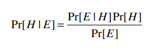
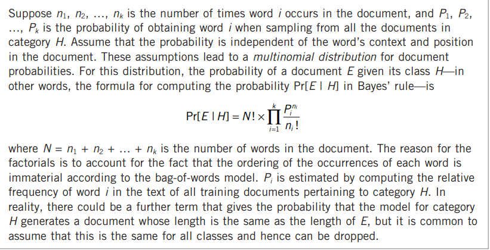
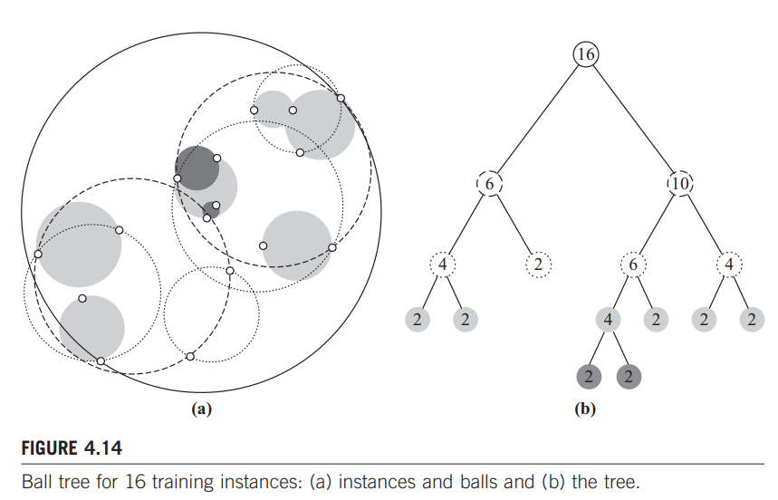

# Data Mining: Practical Machine Learning Tools and Techniques (2011)

In chapter 4, _Algorithms: The Basic Methods_, [Witten, I](DataMining_ch4.pdf) states the simpliest algorithms are often the best initial solutions, then continues with a collection of easy strategies that are highly effective.  By starting with dumb approaches and getting smarter only as needed, the data engineer can reduce the cost to analyze information and extract data insights.

## What is 1-rule (1R)

The one-rule decision tree choose one attribute and has a branch depth of one.  Analyst can enumerate through each of the attributes and built these 1R-trees, then compare which one(s) produce the smallest margin of error.  Since many datasets naturally have a domanant feature, this surfaces the natural cut lines and provides a quality first pass.

```logic
For each attribute,
 For each value of that attribute, make a rule as follows:
 count how often each class appears
 find the most frequent class
 make the rule assign that class to this attribute value.
 Calculate the error rate of the rules.
Choose the rules with the smallest error rate.
```

## What is Naive Bayes

The method "naively" assumes that all attributes are independent, and then calculates the probability that a combination could happen.  When implementing the algorithm it is common to introduce a small constant offset to numerator/demoniator term-- to mitigate any divide by zero.  This error case occurs when specific classes are missing from combinations.  



A common use-case for Bayes is document classification, where the text (e.g., article title) is converted into a `bag of words`.  Bag of words differs from a `set` by allowing terms to be repeated, allowing for word frequency to influence the probability.  For instance "big blue ship" versus the "big blue big ship".



## What is Divide and Conquer

The algorithm attempts to find the shortest decision tree, by applying the `1-rule`-- then recursing for each branch until running out of attributes or no additional gain of information bits.  Information bits != software bits and is a reference to Shannon's Theory of Communication.

### A Mathematical Theory of Communication (1948)

In _The Bell System Technical Journal, Vol. 27, pp. 379–423, 623–656, July, October, 1948._; [Shannon, C](TheoryCommunication.pdf) describes a series of equations that began information theory and allow us to quantify the extent that additional data is providing gains.

### Simplest example of Information Gain in Decision Tree (2018)

In this _YouTube video_; [Bhatt, B](https://youtu.be/mQaAPoRGOcs) walks through a trivial example and the calculations of information gain at each step.

## What are covering algorithms

An altermative to the divide and conquer is to come up with a collection of rules that _covers all classes_.  The strategy might start with a simple rule like:

```python
if x > 1.2: return "a"
```

This rule might include some false positives so it additional rules are needed like the following example.  The process recurses until rules exist to segment values into the appropriate categories.  Unlike the `divide-and-conquer` the rules base appraoch

```python
if x > 1.2:
    if  y < 5: return "a"
    else: return "b"
```

```logic
For each class C
 Initialize E to the instance set
 While E contains instances in class C
 Create a rule R with an empty left-hand side that predicts class C
 Until R is perfect (or there are no more attributes to use) do
 For each attribute A not mentioned in R, and each value v,
 Consider adding the condition A = v to the LHS of R
 Select A and v to maximize the accuracy p/t
 (break ties by choosing the condition with the largest p)
 Add A = v to R
 Remove the instances covered by R from E
```

### How do Rules differ from Trees

>[...] in many situations there is a difference between rules and trees in terms of the perspicuity of the representation. For example, when we described the replicated
subtree problem in Section 3.4, we noted that rules can be symmetric whereas trees must select one attribute to split on first, and this can lead to trees that are much
larger than an equivalent set of rules. Another difference is that, in the multiclass case, a decision tree split takes all classes into account in trying to maximize the
purity of the split, whereas the rule-generating method concentrates on one class at a time, disregarding what happens to the other classes.

## What are Assocation Rules

There are detailed notes in the Week1 Readings that discuss Apriori, that selecting frequent items and then adding one more recursively results in an frequent subsets.

## What is Logistic Regression

A method scales a `target value` between [0,1]-- then attempts to construct an approximation curve.  Since all values are first scaled it becomes easier to associate probabilities and "stack" multiple logistic regression problems together.  For instance, _two-class classification_ can rely on the LR score if (A) or (B) group is more likely.

## What is Perceptron

One of the challenges with LR is that it maps a linear function to [0,1], however many scenarios are non-linear (see [Acquisition Cost Estimating](Mining_AcquisitionCost_Estimates.pdf)).  Perceptron introduces a _hidden layer_ that approximates a linear function and then applies logistic regression to that approximation.

```logic
Set all weights to zero
Until all instances in the training data are classified correctly
 For each instance I in the training data
 If I is classified incorrectly by the perceptron
 If I belongs to the first class add it to the weight vector
 else subtract it from the weight vector
```

## What is Winnow

A linear classification strategy that is very effective for data with binary attributes, where most of them are irrelevant.  It is _mistake driven_ and will only update the weight on bad prediction.

## What is Instance-Based Learning

When the specific examples need to be considered, then clustering algorithms can quickly measure the distance between objects to determine their `nearest neighbors`.  Distance is often calculated as Euclidean sqrt[(a-b)^2] or Manhatton sum[abs(a)+abs(b)].

> The key is to think of actual instances and what it means for them to be separated by a certain distance—what would twice that distance mean, for example?

### What are ball trees

One of the challenges with instance-based learning is that every record is touched, resulting in O(N!) time.  Instead, a tree can be introduced that binary splits the closest "parents" and "siblings" for a node-- reducing the search space.  To determine the sibling a sphere (or circle) is calculated and the nodes that reside on the edge are investigated.

> To use a ball tree to find the nearest neighbor to a given target, start by traversing the tree from the top down to locate the leaf that contains the target and find the
closest point to the target in that ball. This gives an upper bound for the target’s distance from its nearest neighbor. Then, just as for the kD-tree, examine the sibling
node. If the distance from the target to the sibling’s center exceeds its radius plus the current upper bound, it cannot possibly contain a closer point; otherwise, the sibling must be examined by descending the tree further.



## What is k-means clustering

A classical strategy that finds the k-centroids that most efficiently segment the data based on a distance algorithm.

## What is multi-instance learning

> In supervised multi-instance learning, a class label is associated with each bag, and the goal of learning is to determine how the class can be inferred from the instances that make up the bag.  A simple but effective approach is to manipulate the input data to transform it into a single-instance learning problem and then apply standard learning methods.

In addition to the above strategies _aggregating the input or output_ can also compact the bag into a summary.  The summary can contain descriptive statistics (e.g., mean and standard deviation) and those features drive further analysis.

> If a bag contains n instances, giving each one a weight of 1/n ensures that the instances contribute equally to the bag’s class label and each bag receives a total weight of 1.
