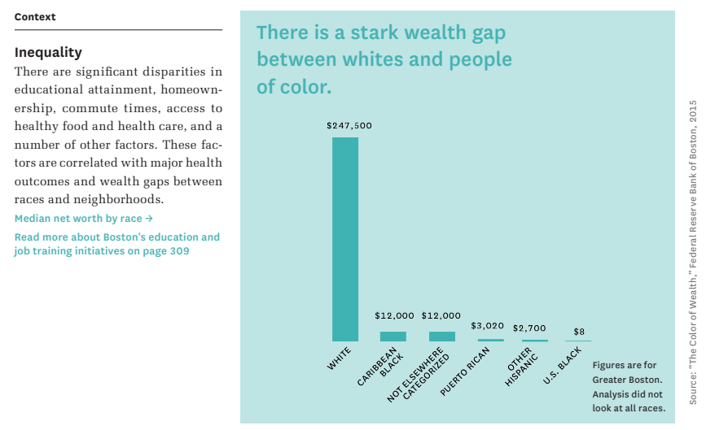

# Imagine Boston 2030

Boston has a collection of [ambitious goals](https://www.boston.gov/departments/mayors-office/imagine-boston-2030) to make their city more progressive.  This touches several areas, such as education and wealth gaps.  Their [dashboard reports](https://analytics.boston.gov/app/imagine-boston) Key Performance Indicators (KPI) to track progress over time.  According to the [City of Boston YouTube](https://youtu.be/V0XVU1gQqzA), metrics have even been calculated backward from 2000 to approximate longitudianal reporting.

## Improving Affordability

The population of Boston has grown over the last 20 years at approximately 1.21% annually.  The city itself is a [fixed size](https://en.wikipedia.org/wiki/Boston) of 89.63 square miles that encompasses 48.42 land and 41.21 water.  So, this raises the question are prices high given their nearly 700k residence trying to live in [very specific](http://zipatlas.com/us/ma/boston/zip-code-comparison/population-density.htm) subdistricts?

Mapping across the table [Demographic breakdown by ZIP code](https://en.wikipedia.org/wiki/Boston#Demographic%20breakdown%20by%20ZIP%20Code) and the zipatlas density, shows that there are very distinct cluster types such as the financial distrinct (02110) versus Mission hill (02120)-- due to a larger concentration of wealth.

Mission hill scores a [C in safety](https://www.niche.com/places-to-live/n/mission-hill-boston-ma/crime-safety/) and [social media](http://www.city-data.com/forum/boston/1253921-mission-hill-safe.html) describes the area as quickly becoming unsafe.  As these aspects improve, shouldn't the pricing of housing _increase_ and that is a sign of improvements to the area?

To further explore into these ideas housing data was [exported from Redfin](https://www.redfin.com/city/1826/MA/Boston) and [cached locally](redfin_2020-03-07-16-04-29.csv).  This data set contains 351 listings for active listings.  These listings show the expected time median listing time is 5 days and at the 95th percentile houses sell within 16 days.

### What are the typical prices

A typical home is between 1220 to 1890 square feet with a price tag of quartiles (P25=599k, P50=899k, P75=1.3M, P99=7.3M), highlighting the long tail nature of real-estate.  

The price per square feet quartile are (P25=494, P50=744, P75=1050, P99=2177).

### What are they doing about this

Imagine Boston is addressing this supply and demand challenge by _Reducing Housing Cost Burden For Bostonians_, specifically with a focus on the percentage of household income that goes towards rent and mortgages.  According to [U.S. Census Bureau, 2000 Decennial Census, 2005-2015 1-year American Community Surveys, PUMS, BPDA Research Division Analysis](https://data.census.gov/mdat/?#/search?ds=ACSPUMS1Y2015) low income individuals consistently spend 45/50% of their income on housing and this has been fairly consistent across time.  The black and hispanic populations are impacted the most by this aspect.

Collectively these figures describe a housing system that is functioning correctly, however compensation for black and hispanic populations at a deficit in specific areas of Boston.  That suggests that targeted stimulus might be more appropriate than broad policy changes.  It's not immediately clear how much involvement needs to happen, since [Unemployment Rates](https://ycharts.com/indicators/boston_ma_unemployment_rate) are at 2.00% suggesting that a tight labor market should precede wage growth.

The [Bureau of Labor Statistics](https://www.bls.gov/regions/new-england/news-release/areaemployment_boston.htm) provides this chart on the areas that are seeing that growth.  There appears to be substantial growth into the _professional and business services_, which could be excluding minorities.  Manufacturing is also seeing a rise and that should lead to the availability of blue collar jobs.  With limited growth into _Leasure, Hospiality and other services_ that could be limiting the need for less skilled workers and discourage wage growth in those industries.  These observations also align with the general observation that Boston is _many distinct clusters of people_.

In the meantime, the city is [subsidizing housing](https://docs.google.com/document/d/1QcvaAmLBQv4K6QXagVmN1CHj4Lg_ryH_AT6epZtOIhQ/edit) with a target of 69,000 units.

## Improving Wealth Inequality

While few would dispute that economic benefit is evenly distributed, the [Executive Summary](https://www.boston.gov/sites/default/files/embed/i/imagine-boston-executive_summary.pdf)([Cached](imagine-boston-executive_summary.pdf)) has a very 'stark' graph of the disparity.  The basis appears to be from page 20 of [The Color of Wealth](The-Color-of-Wealth-in-Boston.pdf)-- that makes the argument that a white household has a median of 247k across their assets in contrast to blacks with a median of 8$.  Not 8 thousand, literally an insufficient amount for McD's.

Another aspect of interest is the [demographics by Race](http://worldpopulationreview.com/us-cities/boston-population/) for Boston specifies that the population of groups like Islanders accounts for 0.04% (247) people and is oversampled.

## Median Hourly Wage of Low-Wage Occupations

The [median income](https://datausa.io/profile/geo/boston-ma/) for Boston is 71,834 and leads to a very different lifestyle than the low-wage earners.

Many of these unskilled workers would require access to housing that costs _roughly 400$/month_, which prevents these people from purchasing homes and accumulating equity.  It becomes even more challenging for low-wage families.

|Industry|Wage/hour|Per Month (40h*26/12W)| Rent Target (35%)|
|Health Care Support|16.99|1472|515|
|Personal Care/Service|13.73|1190|416|
|Building/Cleanining/Maintenance|12.75|1105|386|
|Food Prep|12.25|1061|371|

## Reducing Crime

Boston is the fourth safest major city in the country with 2852 per 100k residents.  The [Crime Incident Reports](https://data.boston.gov/dataset/crime-incident-reports-august-2015-to-date-source-new-system/resource/12cb3883-56f5-47de-afa5-3b1cf61b257b) provides information about these figures.

The top 20 items account for 63% of all police reports.

|Issue|Count|Percent|
|INVESTIGATE PERSON|28059|6%|
|SICK/INJURED/MEDICAL - PERSON|27734|6%|
|M/V - LEAVING SCENE - PROPERTY DAMAGE|23799|5%|
|VANDALISM|21196|5%|
|VERBAL DISPUTE|21178|5%|
|ASSAULT SIMPLE - BATTERY|19888|4%|
|INVESTIGATE PROPERTY|16714|4%|
|TOWED MOTOR VEHICLE|16255|3%|
|THREATS TO DO BODILY HARM|13326|3%|
|LARCENY THEFT FROM BUILDING|13033|3%|
|PROPERTY - LOST|12234|3%|
|LARCENY THEFT FROM MV - NON-ACCESSORY|12195|3%|
|LARCENY SHOPLIFTING|11688|2%|
|WARRANT ARREST|11038|2%|
|LARCENY ALL OTHERS|9028|2%|
|M/V ACCIDENT - PROPERTY  DAMAGE|8903|2%|
|M/V ACCIDENT - PERSONAL INJURY|7177|2%|
|MISSING PERSON - LOCATED|6955|1%|
|ASSAULT - AGGRAVATED - BATTERY|6673|1%|

### Are violent crimes really going down

The metrics claim that violent crimes are decreasing, yet the number of shootings are increasing.

The dashboard also cherry-picks aggravated assault, and excludes other forms of attack.  These figures are also increasing Y/Y.

The category _SEX OFFENSE - RAPE - FORCIBLE_ occurred 47 times last year, versus the first three months of 2020 already has 35.  Interestingly, Tues is the least rapey day of week likely coinsiding with the number of people out drinking.  Police district B2 ([Roxbury](https://en.wikipedia.org/wiki/Roxbury,_Boston)) is home 34% of all 2019 and 17% of 2020 rapes.

Similarly, _Larceny_ is on the rise... based on the spot checking it seems the number of occurrences is remaining steady.
