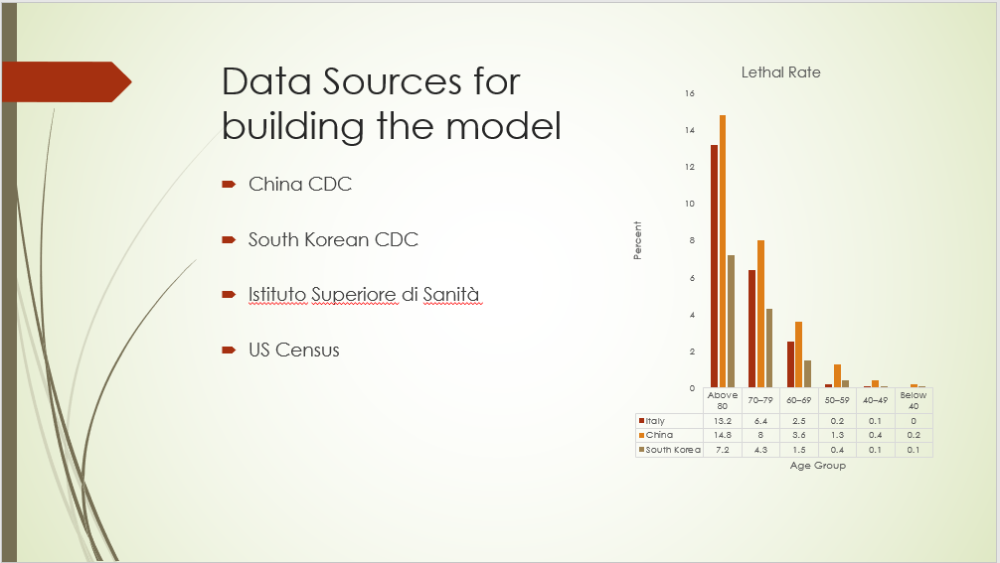
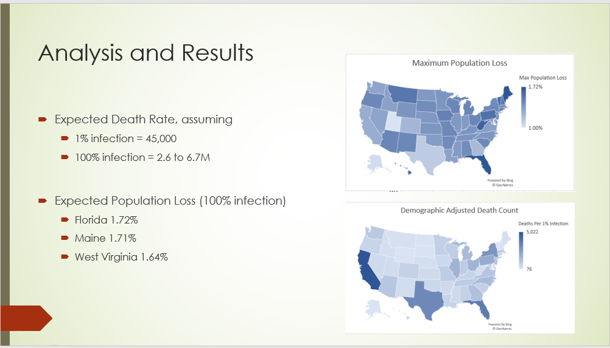

# Coronavirus

The Coronavirus has impacted the stock market and emptied grocery stores, but what is it?  This [novel disease](CurrentKnowledge.pdf) is not unique, and has this genra has been killing farm animals for some time.

## What challenges exist with the current measurements

A lot of panic has occurred in part, because of the confusion around mortality rates-- will this kill me.  While the media reports the metric as `total deaths/total cases`, this is not a good approximatation specifically because the accounting standards are not uniform across the global.  For instance, South Korea has lower infection rates, however their frequent testing increases the denominator more so than Italy.  Another challenge comes from the strong correlation to age, which greatly influences the probability to mortality.

## What alternative approach was used

Instead, [an age demographically weighted average](../BachmeierNTIM8130-6.pptx) needs to exist that takes into account the mortality rate on specific age groups, then accounts for the populations density of those groups.  For example, seniors over the age of 80+ have a 15% chance of dieing versus teenagers stand at 0.2%-- clearly, these heterogeneous populations cannot be combined into a straight average.

My proposed approximation uses the US Census data to [partition per state and county](MortalityRate.xlsx) the residents into age groups: under 40, 40s, 50s, 60s, 70s, and 80+.  Then using the mean age group mortality rate from Italy, China, and South Korea determines the upperband death rate, assuming 100% infection.  In reality, the virus will spread exponentially however a back of the napkin model divides the rate linearly by 100 to get the `mortality rate per 1% infected`.

Based on those results a ballpark figure is _45,000 deaths per 1% of America infected_.  Since this is a linear approximation, the first percent will likely be lower and grow into this amount.  Assuming 100% infection rate, states such as Florida could see a 1.72% population loss as this virus specifically kills senior citizens.  The projected worst case scenario would be 2.6 to 6.7 million deaths (0.8 to 1.8%) assuming the statistics from Italy, China, and South Korea do not change.

## What can we conclude from the mortality curve

If these numbers are accurate or not, it does not change the core point that this virus kills senior citizens.  Healthy individuals need to self-quarantine to prevent the spread to immune compromised persons.  The vast majority of us will be fine, however failure to limit the virus will kill large numbers older people.

## What other limits exist to this research

These results do not account for pre-existing conditions, influence of cigerette smoking, etc.-- as this is was a single weekend assignment.  The lethal rates for the age groups are similar across Italy and China, though South Korea is 50% as much.

## Resources

- [University of Washington Interactive Map](https://hgis.uw.edu/virus/)
- [Johns Hopkins Interactive Map](https://coronavirus.jhu.edu/map.html)
- [Age, Sex and Existing Conditions](https://www.worldometers.info/coronavirus/coronavirus-age-sex-demographics/)
- [US Demographics](https://www.infoplease.com/us/comprehensive-census-data-state/demographic-statistics-342)
- [Italy Demographics](https://www.livepopulation.com/country/italy.html)
- [South Korea Demographics](https://www.statista.com/statistics/242558/age-distribution-in-south-korea/)
- [South Korea Population](https://worldpopulationreview.com/countries/south-korea-population/)
- [US Population Density](https://en.wikipedia.org/wiki/List_of_states_and_territories_of_the_United_States_by_population_density)
- [South Korea Death Rate](https://www.businessinsider.com/coronavirus-death-rates-by-age-south-korea)