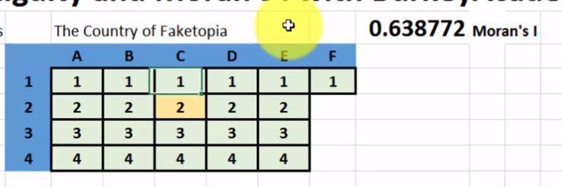
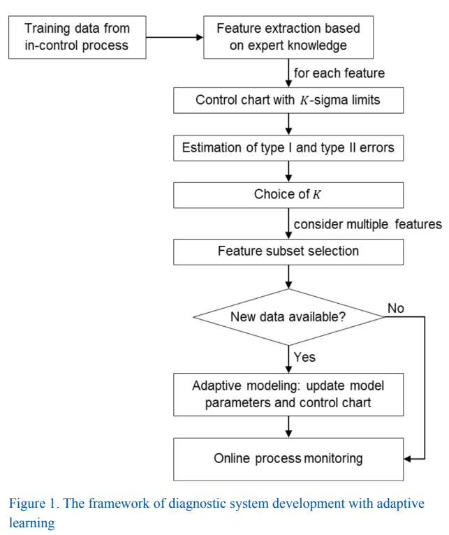

# Readings

## Spatial Correlation (Moran's I) and Contiguity (2017)

A [video by BurkeyAcademy](https://www.youtube.com/watch?v=cdWH5frHg5E) starts with a review of Pearson correlation which uses `covariance`  to determine relationships.  A covariance is defined as `sum( (x[i] - mean(x)) (y[i] - mean(y)) ) / n-1`.  This will give either a positive (correlated) or negative (inverse) value that represents the degree.  The value can be `standardized` by dividing the covariance by the standard deviation.

These ideas can be applied to spatial data sets, by first creating the `Contiguity Matrix` (aka adjacency matrix) that defines which sectors have an edge between each other.  For instance, a really simple state might have three zip codes (box 1) labeled as 1 to 3.  Next convert into an edge matrix, such as (A1,D1) to (B2,D1), are the same "zip code" so they form an edge.  Then standardize each row by taking the sum of the row and dividing all values within the row by weight.  This makes all values between 0 to 1.

```text
|-| A | B | C |          |-| A | B | C |                 |-| A  | B  | C  |
|D| 1 | 1 | 1 |  =edges> |D| 1 | 1 | 1 |  =standardize>  |D| .3 | .3 | .3 |
|E| 0 | 2 | 3 |          |E| 0 | 0 | 1 |                 |E| 0  | 0  | 1  |
|F| 0 | 0 | 3 |          |F| 0 | 0 | 1 |                 |F| 0  | 0  | 1  |
```

With `Moran's I`, you take the covariance of between two regions then divide by `sum (x[i] - mean X)^2` to get a value between -1 and 1.  Then multiply by the cotiguity matrix to cancel out any any non edges.

### What does this tell us

Assume that the values in [this matrix represent](https://drive.google.com/file/d/0B3-F8BTZSbH9NEVJM2c1Tkg2SjQ/view) wealth distribution (e.g. 1= low-income), then there is clearly a relationship between both the horizontal and vertical directions.  Using Moran's I this correlation to express the strength of this information.  By randomly flipping bits, the presenter shows that the correlation deteriorates as the noise is added to this trivial example (time=20:34 seconds).



## Calculating Spatial with Python

This [GitHub page](https://github.com/SpatialPython/spatial_python/blob/master/packages.md) enumerates various Geospatial packages for Python.  Users of [GeoPandas](https://github.com/geopandas/geopandas) can define polygons and then perform shapely geometry.

## A Statistical Toolbox For Mining And Modeling Spatial Data (2016)

In _Comparative Economic Research. 12/15/2016, Vol. 19 Issue 5, p5-24. 20p._; [D'Aubigny](Statistical_Toolbox.pdf) state that when researchers analyze spatial data sets they attempt to autocorrelate using `Moran's and the Geary's coefficients`.  However there are numerous occurrances where this process is incorrectly applied and not challenged.  This leads to inaccurate conclusions that do not align with future observations.  The paper continues with way more math than I have coffee.

## Analysis on a New Data Mining Algorithm of the Statistics Work (2016)

In _Telkomnika. Sep2016, Vol. 14 Issue 3A, p42-46. 5p. 2 Charts._; [Ding; Ha; Li](Analysis_DM_of_Statistical_Work.pdf) discusses the importance for governments to have statistical departments.  These mathematicians need to evaluate macro-trends across the country, using revolutionary technologies like cloud computing.  There also needs to be an adoption of data warehousing technologies to improve the retrieval and analysis of these large data sets.

They also suggest a strong emphasis on item set mining, in addition to more traditional strategies, such as neuro networks and regression algorithms.

## A Data-Driven Diagnostic System Utilizing Manufacturing Data Mining and Analytics (2017)

In _SAE International Journal of Materials & Manufacturing. Jul2017, Vol. 10 Issue 3, p30-40. 11p._; [Weihong et al.](Diagnostic_Utilizing_Manufacturing.pdf) describe the sensing devices, used by one Ford production plant, that discover errors through optimal feature selection and correlation structures.  The automotive manufacturing industry continues to be the leader across manufacturing innovation, most recently due to low-cost IoT and smart devices.

A common scenario in the assembly process, is that one component can fail and then cascade delays to downstream components.  These delays cause lost productivity and thus reduce output.  It is critical to the business success that these issues are detected, diagnosed, and mitigated promptly.  The presenters set out to build a data driven diagnostis solution, that builds on previously chosen features and KPIs.  

### How did they build the analysis system

In order to develop this new methodology, the following issues will be discussed in the paper:

1. Determining the underlying probability distribution of a feature using the goodness-of-fit test, based on which the basic control charts are designed
2. Determining control limits, which balances the type I and type II errors
3. Optimal feature subset selection by minimizing a weighted summation of the type I and type II errors associated with the features considered; two selection strategies are propose
4. Adaptive modeling of the feature distribution using Bayesian inferences
5. Online process monitoring with adaptive control limits and sensitizing rules.



### How are control ranges used

A common feature type is the number of failures in a rolling 24 hours or 7 days.  They model these values with a Poissan distribution, and assume that normal control range is the `mean(X) +/- K*stddev(X)` for the sample set `X`.  For example, when `K=2` this covers 95% of the expected range and helps to determine when anomalies are occurring.

- Type I: False Positive
- Type II: Failure to detect/prevent an out-of control process.

*NOTE*: Presenters at [365 Data Science](https://www.youtube.com/watch?v=BbLfV0wOeyc) provide a refresher on the Poisson distribution, and how it _deals with frequency with which an event occurs_-- not raw probability.  For example a firefly lights up _3 times in 10 seconds_, would be represented as `Y ~ Po(3)`.  What are the chances that another firefly lights up _exactly_ 7 times?  Answer (Excel): `POISSON.DIST(7,3,FALSE)` is 2.1%.

## Data Mining: Chapter 6: Implementions: Real Machine Learning (2011)

In [Chapter 6](DataMining_ch6_Implementations.pdf) builds on the [Simple Algorithms - Chapter 4](../../Week3_Application/Readings/SimpleAlgorithms.md), with various optimization techniques reducing the complexity in real world scenarios.  For instance, layers in decision trees can be pruned to lessen the number of branches that are encoded.  In many scenarios, simple models perform better due to a prevention of overfitting.

### DensiTree Application

The authors recommend [this tool](https://www.cs.auckland.ac.nz/~remco/DensiTree/) for making pretty decision tree graphs from large data sets.
