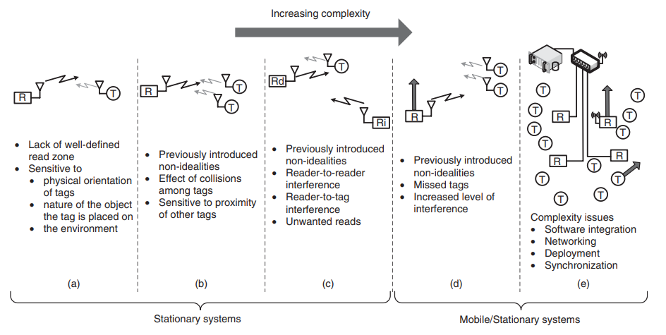
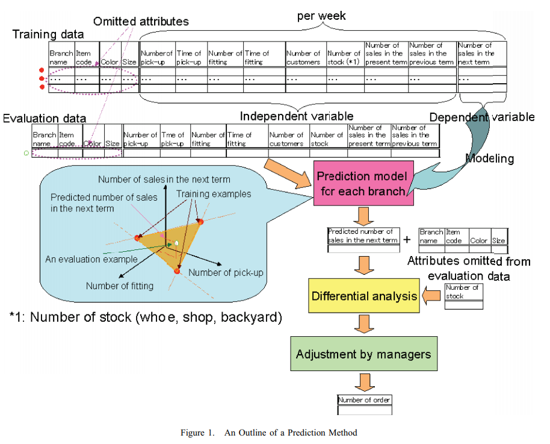

# Radio Frequency Identification (RFID)

## RFID systems: research trends and challenges (2010)

From _Chichester, West Sussex: Wiley, 2010_; [Bolic et al.](RFID_Systems_ch1.pdf) - [ebook](http://proxy1.ncu.edu/login?url=https://search.ebscohost.com/login.aspx?direct=true&db=cat01034a&AN=nu.EBC555052&site=eds-live) - reviews the history of RFID, its applications and some of the limitations.  The technology dates back to World War II and uses _backscatter modulation_ to reflect a signal in a specific way.  Over the next 60 years the mass production transitioned RFID from a military solution to commercially viable, where it _finds various applications in diverse fields such as supply chain management, indoor asset and personnel tracking, access control, robotics and many more._

### What are the advantages of RFID

Some of these advantages are (e.g. over barcodes):

1. passive RFID tags can be read at much greater distances than barcodes;
2. there is no need for a line of sight between the reader and tag;
3. multiple tags can be read at much higher rates than barcodes;
4. RFID tags have much larger memory than barcodes which allows storage of a lot more information than just the ID;
5. the information contained in the RFID tag can be modified dynamically using the interrogator.

### What are the characteristics of an ideal RFID system

RFID tags can be passive, semi-passive, or active -- denoting that activation comes from a reader or a local battery.  Passive tags require sufficient power to both wake up and begin emitting the signal.  It would also be ideal if only one tag emits the signal and its 100% readable.  However in practice, many tags can become activated at the same time and there needs to be distinct frequencies to avoid collisions (860-960 MHz band).  It would also be preferrable that performance is insensitive to the orientation, nature of the tagged object, movement of object, or environment; though in practice these external forces complicate manners.  A perfect system should also support multiple readers with overlapping read zones.

> Hence for the ideal system if a reader sends out N queries to a population of tags that are all within its well-defined read zone, it receives N responses from each of the tags containing their respective IDs.

### What are limitations of Gen 2 Aloha-based anti-collision protocol

When the reader issues a command it inserts a random 16-bit slot value, that is replied from the Gen 2 RFID tag to denote who the message is in response too.  This allows multiple readers to issue parallel commands and removes collision concerns.  There is also a 16-bit CRC header check to confirm the response is complete and not corrupt by overlapping tags.

Based on the authors investigations tags generally read correctly up to a distance of about 3m, afterward the quality decreases to zero in relation to the orientation of the tag.  At a 60 degree rotation the signal strength reduces to about 3m.

Similar to other wireless technologies the environment significantly alters the quality of transmission, such as fading the signal or creating blind spots.  The transmission is also limited when attached to metal or fluid objects-- or these materials are near (called detuning).  These external factors can reduce the read distance to one or two meters.  Multiple tags can also respond and cause collisions to the same Aloha query slot.  These collisions increase read latency and reduce the supportable density of placement (4cm minimum spacing).

Multiple readers can also collide with each other, so the Gen2 protocol supports specifying a signal boost (e.g., 6dB) -- to distinguish overlapping responses between different readers.

### How does RFID security work

Tags support both locked and unlocked memory spaces that control access.  Access to a secure segment requires a 32-bit password, however this only prevents negligence not maliciousness due to the small key space.  It is also possible for external systems to eavesdrop on the communication as it takes place across the open air.  Stronger encryption of passive tags is not possible, due to the low power design without impacting performance.  However, active tags contain a local battery and can support more complex circuits though at a higher cost.

## Inventory misplacement and demand forecast error in the supply chain: profitable RFID strategies under wholesale and buy-back contracts (2018)

In _International Journal of Production Research. Aug2018, Vol. 56 Issue 15, p5188-5205. 18p._; [Zhang et al.](InventoryManagement.pdf) state that the loss of inventory is a common and costly problem across supply chains.  Not only does the problem cause lost inventory, but also creates inefficiencies with demand forcasting.  Several large retailers (e.g., Walmart and Target) have moved to mandate RFID across their supply chain -- which allows them to automate the procurement and filliment of inventory from end-to-end.  

The criticality of accuracy across supply chain management is throughly discussed as part of [TIM-7020 Business Intelligence Week2 Case Study](https://github.com/dr-natetorious/TIM-7020-Database_and_Business_Intelligence/tree/master/Week3_BlackBeanTea_CaseStudy/BachmeierNTIM7020-3.docx).

## Application of the RFID Data Mining to an Apparel Field (2010)

At _13th International Conference on Network-Based Information Systems Network-Based Information Systems (NBiS). Sept, 2010_; [Sakuai et al.](ApparelField.pdf) provides a case study where an apparel outlet inserted RFID tags into all products and strategically placed readers around the store.  This provides a mechanism for the store to track individual items as customers inspect and try on the garmets, and ensures the item does not become lost.  Though monitoring of the item's lifecycle within the story, the data analysis team can make more accurate forecasts about items that were considered in addition to those actually purchased.

For instance, if a person picked up a Playstation and XBOX but only bought one of them, the point of sales (POS) could only tell the business that a custom purchased the xbox.  It would not provide the marketing guidance that the customer actually wanted both.  The same behavior can be seen with different clothing items, and might provide another pivot of the data to infer -- apripori style -- that specific items are canabolizing other item sales.  That might be good or could be bad, until measured its difficult to known outside of anicodal evidence.

## Adding RFID Capabilities to IoT Technologies: Proof-of-Concept on Microwave Doppler Sensors (2019)

At _IEEE International Conference on RFID Technology and Applications (RFID-TA) Sept, 2019_; [Colella et al.](RFID_to_IoT.pdf)...

## Radio-Frequency Identification Specimen Tracking to Improve Quality in Anatomic Pathology (2020)

In _Archives of Pathology & Laboratory Medicine (ARCH PATHOL LAB MED), Feb2020; 144(2): 189-195. (7p)_; [Norgan et al.](RFID_SpecimenTracking.pdf)...
