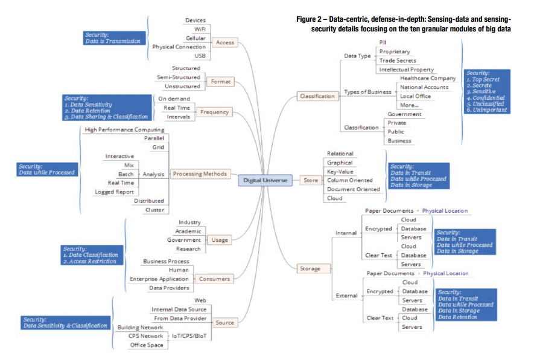
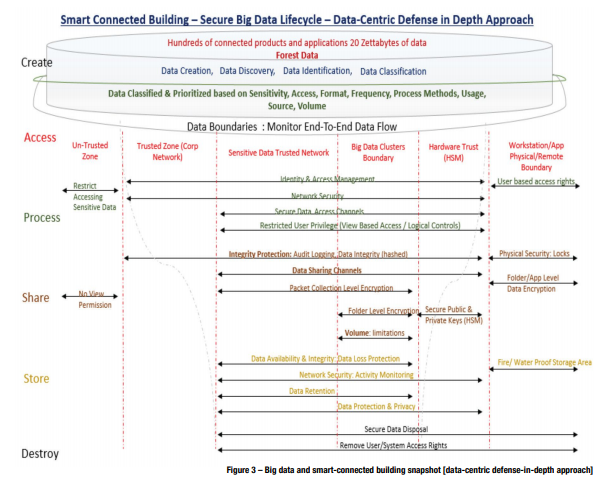

# Readings

## Data Mining for the Internet of Things: Literature Review and Challenges (2015)

In _International Journal of Distributed Sensor Networks. 8/30/2015, Vol. 2015, p1-14. 14p._; [Chen et al.](Securing_Body_Sensor_Networks.pdf)...

## Improvised methods for tackling big data stream mining challenges: case study of human activity recognition (2016)

In _Journal of Supercomputing. Oct2016, Vol. 72 Issue 10, p3927-3959. 33p._; [Fong et al.](ImprovisedMethods_for_BigDataStreamMining.pdf)...

## Domain mining for machine translation (2015)

In _Journal of Intelligent & Fuzzy Systems. 2015, Vol. 29 Issue 6, p2769-2777. 9p._; [Junfei et al.](DomainMiningMachineTranslation.pdf)...

## A hybrid data mining model in analyzing corporate social responsibility (2016)

In _Neural Computing & Applications. Apr2016, Vol. 27 Issue 3, p749-760. 12p._; [Pai et al.](HybridMining_Analyzing_CorporateSocailResponsibility.pdf)...

## Predicting Missing Values in a Dataset: Challenges and Approaches (2017)

In _International Journal of Recent Research Aspects. Sep2017, Vol. 4 Issue 3, p34-38. 5p._; [Rawal et al.](PredictingMissingValues.pdf) state that nearly all real-world data has missing values and these introduce challenges for mining and classification algorithms.  These concerns raise the need to predict those values and fill in any gaps.

Missing values can be categorized as:

- Missing completely at random (MCAR) - if the events that lead to any particular data item being missing are independent of both the observable variables and unobservable parameters of interest.
- Missing at random (MAR) - some attribute are not randomly distributed across the observations but are distributed within one or more sample.
- Not missing at random (NMAR) - the missing data is dependent on the values of the attribute.

### How much data can be missing or erroneous

|Amount Missing| Impact on accuracy|
| < 1%| Negliable to non issue |
| 1-5%| Managable to some extent |
| 5-15%| Requires Sophisticated methods |

### What are the challenges in predicting missing values

1. The missing data prediction method should not alter the distribution of data.
2. The relationships between the attributes of the data set must be retained by the prediction method deployed.
3. The prediction method should not be too complex and should not have high time cost factor.
4. The missing values should be predicted and replaced in such a way that all the data mining analytical procedures can be applied to the newly completed dataset easily.

### What are common solutions

- Use the mean value of the attribute
- Discard the incomplete records
- Column-wise Guided Data Imputation method (CGDI) - e.g., K-nearest neighbor (KNN) or regression
- Unsupervised Feature Learning
- Association rules (e.g., Apripori) to guess best choice based on support
- Decision trees to guess the best choice based on the other features

In this video, [Naik, K](https://www.youtube.com/watch?v=q-DyjA8ZmYM) discusses similar ideas as this paper.

## A Data-Centric, Defense-in-Depth Approach for Securing the Internet of Things (2018)

In _ISSA Journal. Jun2018, Vol. 16 Issue 6, p40-46. 7p._; [Sivagnanam, M](DataCentric_Approach_Securing_IoT.pdf) highlights the need for securing IoT data as it can easily accumulate personally identifable information (PII) and other sensitive information.  These concerns increase as the volume of IoT information trends towards big data workloads, as the ocean requires _information governance policies_, specifically around retention, encryption, and access.

> The approach classifies big data into ten granular modules: Data access, data format, data frequency, data processing methods, data usage, data consumers, data source, data classification, data store, and data storage.   These classifications facilitate implementing a data-centric security approach with three primary security controls: Preventive, detective, and administrative. [...]  The life cycle of big data has six main stages: creation and discovery, access and data flow, process, share, store, and destroy.

## AMA-TV: Big data, rejection, customer forecasting, and social media security (2013)

During a video interview [Mauricio, R; Kovacs, E](https://sk-sagepub-com.proxy1.ncu.edu/video/ama-tv-big-data-rejection-customer-forecasting-and-social-media-security) discuss analogy that big data is the new oil, and like oil it isn't particularly useful in its crude form.  However, through refinement processes researchers can extract insights into the populations and make more accurate predictions.  Then a segment on interview rejection recommends that candidates explore the reasons for rejections, as that enables them to make alterations and become more attractive to employers.  Next, was a short bit about the integration of big data and advanced marketing to find a pool of customers (e.g., that will buy a cruise ship vacation).  Finally the news program ends with a reminder that social media security is critical and begins with efficient password management.
