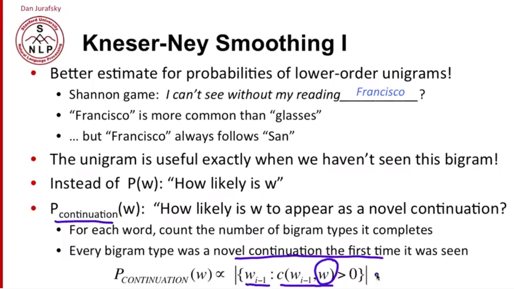
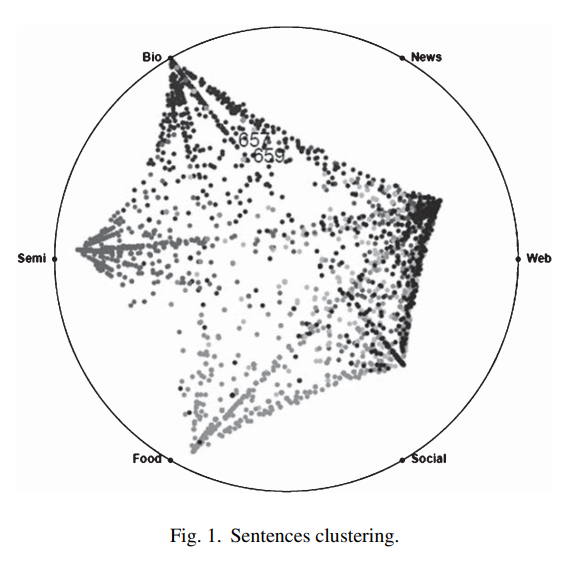

# Readings

## Data Mining for the Internet of Things: Literature Review and Challenges (2015)

In _International Journal of Distributed Sensor Networks. 8/30/2015, Vol. 2015, p1-14. 14p._; [Chen et al.](Securing_Body_Sensor_Networks.pdf)...

## Improvised methods for tackling big data stream mining challenges: case study of human activity recognition (2016)

In _Journal of Supercomputing. Oct2016, Vol. 72 Issue 10, p3927-3959. 33p._; [Fong et al.](ImprovisedMethods_for_BigDataStreamMining.pdf)...

## Domain mining for machine translation (2015)

In _Journal of Intelligent & Fuzzy Systems. 2015, Vol. 29 Issue 6, p2769-2777. 9p._; [Junfei et al.](DomainMiningMachineTranslation.pdf) discusses natural language processing for the scenario of language translation (e.g., English to French).  Making an accurate translation is complex due to language being highly contextual, and a simple A to B map does not produce quality results.  These issues are compounded when dealing with a specific domain (e.g., physics or financial calculus)-- as the availability of training data is sparse.  The researchers get around these issues by creating a Language Model (LM) and then performing statistics modeling on the domain specific informaiton.

### How do they create a language model

The most popular LM is called Kneser-Neys, followed by SRILM and KenLM.  These approaches attempt to estimate a discount function that feeds into a linear interpolation solution.  In this video [Jain, M](https://www.youtube.com/watch?v=eNLUo3AIvcQ)(2018) decrypts that statement by explaining what Kneser-Neys smoothing entails.  Jain states that a naive solution is to look at the statistical weight of the `word[i+1]` based on `word[i-1]` and then apply a constant adjustment.  Instead, a _continuation probability_ looks at the likelihood that the next word naturally extends the sentence.  For instance, "I can't see without my [blank]"  -- using `Franciso` does not make sense because the partial sentence is lacking term `San`.

### How do you apply topic clustering

The authors use Latent Dirichlet allocation (LDA), to cluster the documents based on their similarity.  [Knispelis](https://www.youtube.com/watch?v=3mHy4OSyRf0) explains the algorithm through the example of finding similar magazine content.  He uses `gensim` a python module for topic modeling across Wikipedia, an approximately 12GB dataset, and applies filters to remove garbage and common words (e.g. and) -- to find the top N words.  Using LDA creates a hierarchial probability data structure that maps words -> topics -> context.  The words that are that are not in the training set are ignored, and then the frequency of those words creates a histogram.  These histograms creates a distribution that places the each data point on a `N-dimension space` where N is the number of topics.  `Jenson-Shannon Divergence` gives us the distance between distributions two data points and thus its likelihood of being related.

## A hybrid data mining model in analyzing corporate social responsibility (2016)

In _Neural Computing & Applications. Apr2016, Vol. 27 Issue 3, p749-760. 12p._; [Pai et al.](HybridMining_Analyzing_CorporateSocailResponsibility.pdf) notes that corporate social responsibility continues to be a hot topic, though most analysis relies on traditional statistics and not data mining strategies.  The authors fill this gap with various pre-processing solutions that focus on fuzzy clsutering, State Vector Machines (SVM), and decision trees.  There is some degree of controversy whether it is the responsibility of corporations to be socially responsible, though a growing interest among investors (especially mellenails) generates the need to publish statistics.  

This was an interesting case study on how ensemble and pre-processing methods boost model accuracy, and can provide reasonable estimates to real world data sets.  They express the need for further research into these ideas and there application.

## Predicting Missing Values in a Dataset: Challenges and Approaches (2017)

In _International Journal of Recent Research Aspects. Sep2017, Vol. 4 Issue 3, p34-38. 5p._; [Rawal et al.](PredictingMissingValues.pdf) state that nearly all real-world data has missing values and these introduce challenges for mining and classification algorithms.  These concerns raise the need to predict those values and fill in any gaps.

Missing values can be categorized as:

- Missing completely at random (MCAR) - if the events that lead to any particular data item being missing are independent of both the observable variables and unobservable parameters of interest.
- Missing at random (MAR) - some attribute are not randomly distributed across the observations but are distributed within one or more sample.
- Not missing at random (NMAR) - the missing data is dependent on the values of the attribute.

### How much data can be missing or erroneous

|Amount Missing| Impact on accuracy|
| < 1%| Negliable to non issue |
| 1-5%| Managable to some extent |
| 5-15%| Requires Sophisticated methods |

### What are the challenges in predicting missing values

1. The missing data prediction method should not alter the distribution of data.
2. The relationships between the attributes of the data set must be retained by the prediction method deployed.
3. The prediction method should not be too complex and should not have high time cost factor.
4. The missing values should be predicted and replaced in such a way that all the data mining analytical procedures can be applied to the newly completed dataset easily.

### What are common solutions

- Use the mean value of the attribute
- Discard the incomplete records
- Column-wise Guided Data Imputation method (CGDI) - e.g., K-nearest neighbor (KNN) or regression
- Unsupervised Feature Learning
- Association rules (e.g., Apripori) to guess best choice based on support
- Decision trees to guess the best choice based on the other features

In this video, [Naik, K](https://www.youtube.com/watch?v=q-DyjA8ZmYM) discusses similar ideas as this paper.

## A Data-Centric, Defense-in-Depth Approach for Securing the Internet of Things (2018)

In _ISSA Journal. Jun2018, Vol. 16 Issue 6, p40-46. 7p._; [Sivagnanam, M](DataCentric_Approach_Securing_IoT.pdf) highlights the need for securing IoT data as it can easily accumulate personally identifable information (PII) and other sensitive information.  These concerns increase as the volume of IoT information trends towards big data workloads, as the ocean requires _information governance policies_, specifically around retention, encryption, and access.

> The approach classifies big data into ten granular modules: Data access, data format, data frequency, data processing methods, data usage, data consumers, data source, data classification, data store, and data storage.   These classifications facilitate implementing a data-centric security approach with three primary security controls: Preventive, detective, and administrative. [...]  The life cycle of big data has six main stages: creation and discovery, access and data flow, process, share, store, and destroy.

## AMA-TV: Big data, rejection, customer forecasting, and social media security (2013)

During a video interview [Mauricio, R; Kovacs, E](https://sk-sagepub-com.proxy1.ncu.edu/video/ama-tv-big-data-rejection-customer-forecasting-and-social-media-security) discuss analogy that big data is the new oil, and like oil it isn't particularly useful in its crude form.  However, through refinement processes researchers can extract insights into the populations and make more accurate predictions.  Then a segment on interview rejection recommends that candidates explore the reasons for rejections, as that enables them to make alterations and become more attractive to employers.  Next, was a short bit about the integration of big data and advanced marketing to find a pool of customers (e.g., that will buy a cruise ship vacation).  Finally the news program ends with a reminder that social media security is critical and begins with efficient password management.
